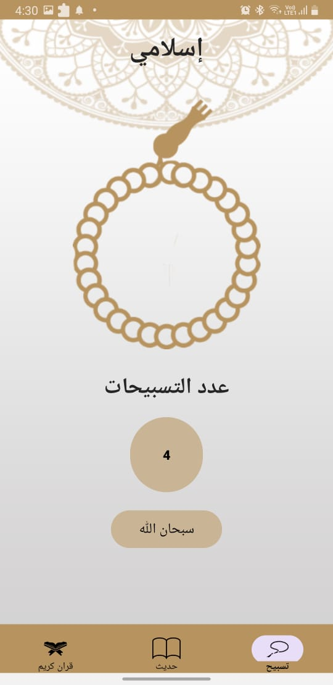

* This app contains three Activities 
1- MainActivity for display fragments
2- QuranDetailsAcivity for display each surah of quran 
3- HadethDetailsActivity for display each hadeth

* Contains three Fragments
1- QuranFragment to display list of names of quran's surah and number of Ayat
2- HadethFragment to display list of prophetic talks
3- tasbehFragment to dislay sebha and counter to count number of praise 

https://github.com/sherifelkady70/Islami-Application/blob/master/SplashScreenInIslamiApp.jpg)

